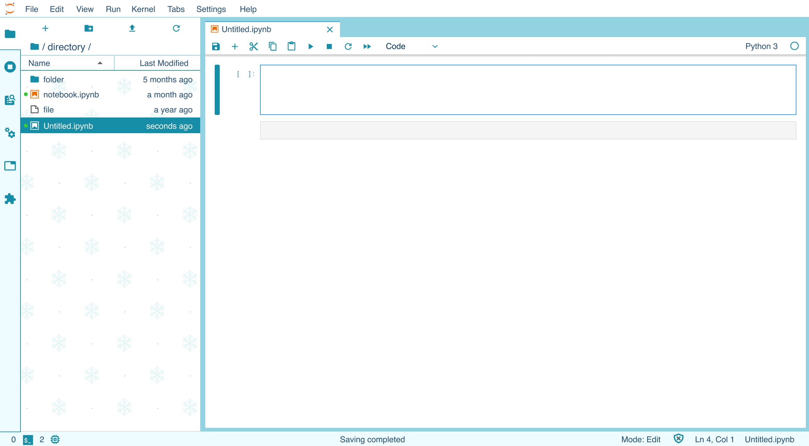

[](https://datalayer.io)

# Ξ JupyterLab Theme for Winter

> Design by [Isabela Presedo-Floyd](https://github.com/isabela-pf), coded with the help of Jovyans at [Quansight](https://github.com/quansight)



## Use

```bash
conda create -y -n jupyterlab-theme-winter python=3.8 && \
  conda activate jupyterlab-theme-winter && \
  pip install --pre jupyterlab==3.0.0rc10 jupyterlab_theme_winter --upgrade --force-reinstall

# How to launch jupyter lab with a defined theme?
mkdir -p ~/.jupyter/lab/user-settings/\@jupyterlab/apputils-extension && \
  CONF="{ \"theme\": \"JupyterLab Winter\" }" && \
  cat > ~/.jupyter/lab/user-settings/\@jupyterlab/apputils-extension/themes.jupyterlab-settings  <<EOF
${CONF}
EOF
jupyter lab
```

> TODO

- Update the Launcher page with something like e.g. https://github.com/fcollonval/jlab-enhanced-launcher
- Strip down the variables.css to only the needed css?
- Bring more fancy ui like in https://github.com/timkpaine/jupyterlab_miami_nights: Search tool + neon billboard + Collapser + neon light + Scrollbar + FM-84's "Atlas" (compatible with webKit browsers) + A surprise in the presentation mode (Top menu --> View --> Presention mode)

## Develop

```bash
# Build the extension and link for dev in shell 1.
jupyter labextension develop --overwrite
```

```bash
# List extensions.
jupyter labextension list
pip list | grep  jupyterlab-theme-winter
```

```bash
# Run and watch jupyterlab in shell 1.
jlpm watch
```

```bash
# Run and watch jupyterlab in shell 2.
# Look at the remote entry javascript, a webpack5 feature.
mkdir ~/notebooks && \
  jupyter lab \
    --dev-mode \
    --watch \
    --notebook-dir=~/notebooks \
    --ServerApp.token= \
    --extensions-in-dev-mode
```

## Build

```bash
# Generate sourcemaps.
jupyter labextension build --development True .
jupyter lab build --minimize=False
```

```bash
# Do not generate sourcemaps.
jupyter labextension build .
jupyter lab build
```

## Publish

```bash
pip install jupyter_packaging twine && \
  python setup.py sdist bdist_wheel && \
  twine upload dist/*
```

```bash
jlpm build:lib && \
  npm publish --access public
```
